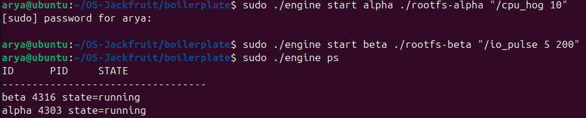
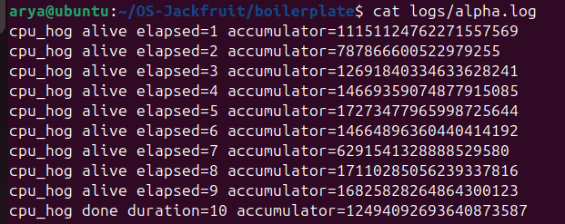
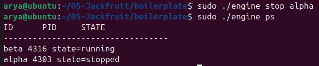
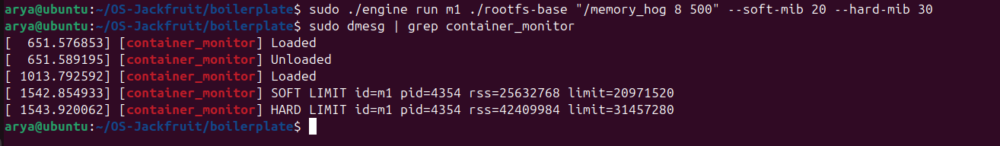
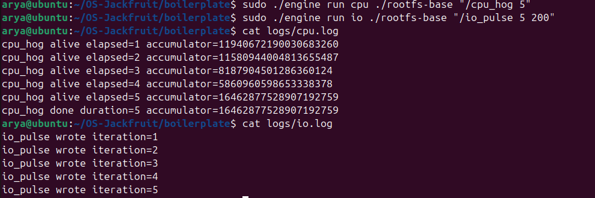
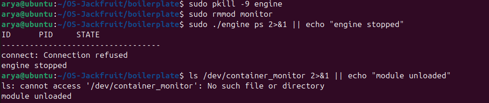

# Multi-Container Runtime

A lightweight Linux container runtime written in C, featuring a long-running supervisor process, kernel-level memory enforcement, and scheduling experiments.

---

## 1. Team Information

- Anumula Arya - PES1UG24CS072
- Apurv Kumar Singh - PES1UG24CS077

---

## 2. Build, Load, and Run Instructions

### Prerequisites

- Ubuntu 22.04 or 24.04
- Secure Boot must be OFF
- `gcc`, `make`, `build-essential`, kernel headers

```bash
sudo apt update
sudo apt install -y build-essential linux-headers-$(uname -r)
```

### Build

```bash
cd boilerplate
make clean
make
```

This produces: `engine`, `monitor.ko`, `cpu_hog`, `memory_hog`, `io_pulse`

### Setup Root Filesystem

```bash
mkdir rootfs-base
wget https://dl-cdn.alpinelinux.org/alpine/v3.20/releases/x86_64/alpine-minirootfs-3.20.3-x86_64.tar.gz
tar -xzf alpine-minirootfs-3.20.3-x86_64.tar.gz -C rootfs-base

cp cpu_hog memory_hog io_pulse rootfs-base/

cp -a ./rootfs-base ./rootfs-alpha
cp -a ./rootfs-base ./rootfs-beta
```

### Load the Kernel Module

```bash
sudo insmod monitor.ko
ls -l /dev/container_monitor
```

### Start the Supervisor

Run this in a dedicated terminal and leave it running:

```bash
sudo ./engine supervisor ./rootfs-base
```

### Run Containers

In a second terminal:

```bash
# Start background containers
sudo ./engine start alpha ./rootfs-alpha "/cpu_hog 10"
sudo ./engine start beta ./rootfs-beta "/io_pulse 5 200"

# Check status
sudo ./engine ps

# View logs
cat logs/alpha.log

# Run a foreground container
sudo ./engine run c1 ./rootfs-base "/cpu_hog 5"
```

### Memory Limit Test

```bash
sudo ./engine run m1 ./rootfs-base "/memory_hog 8 500" --soft-mib 20 --hard-mib 30
sudo dmesg | grep container_monitor
```

### Stop Containers

```bash
sudo ./engine stop alpha
sudo ./engine stop beta
```

### Cleanup

```bash
sudo pkill -9 engine
sudo rmmod monitor
```

---

## 3. Demo with Screenshots

### Multi-container supervision

Two containers running simultaneously under a single supervisor process.



---

### Metadata tracking

Output of `engine ps` showing container ID, PID, and current state for each tracked container.


---

### Bounded-buffer logging

Per-container log files written through the pipe-based producer-consumer logging pipeline.



---

### CLI and IPC

A `stop` command sent via the UNIX domain socket, with the subsequent `ps` confirming the supervisor updated the container state.



---

### Soft-limit warning

Kernel log showing a soft memory warning triggered for container `m1` when RSS crossed the configured threshold.



---

### Hard-limit enforcement

Kernel log showing container `m1` terminated after exceeding the hard memory limit.


---

### Scheduling experiment

`cpu_hog` producing continuous output vs `io_pulse` writing at intervals — demonstrating how the Linux scheduler treats CPU-bound and I/O-bound processes differently.



---

### Clean teardown

Engine stopped, module unloaded, and `/dev/container_monitor` confirmed gone — no zombies or stale state remaining.



---

## 4. Engineering Analysis

### Isolation Mechanisms

Containers are created using `clone()` with `CLONE_NEWPID`, `CLONE_NEWUTS`, and `CLONE_NEWNS` flags. PID namespace isolation gives each container its own process hierarchy starting from PID 1, preventing it from seeing or signaling host processes. UTS isolation lets each container hold a separate hostname. Mount namespace isolation ensures filesystem changes inside the container don't affect the host.

`chroot()` is used to restrict the container's filesystem view to its own rootfs copy. `/proc` is mounted inside each container so tools like `ps` work correctly within the isolated environment. The host kernel itself is still shared — containers share the same kernel, scheduler, and physical memory — only the views and identifiers are virtualized.

### Supervisor and Process Lifecycle

A long-running supervisor is necessary because child process cleanup requires a parent to call `waitpid()`. Without it, exited containers become zombies. The supervisor uses `SIGCHLD` handling to reap children as they exit, update their metadata, and log their final state.

Each container is spawned as a child of the supervisor via `clone()`. The supervisor tracks metadata for every container including its PID, state, memory limits, log file path, and exit status. This centralized model makes it straightforward to serve `ps`, `logs`, and `stop` commands from a single place without needing distributed coordination.

### IPC, Threads, and Synchronization

Two separate IPC mechanisms are used. Control commands (start, stop, ps) travel over a UNIX domain socket between the CLI client and the supervisor. This gives a clean request-response model where each CLI invocation is a short-lived client. The logging path is entirely separate — each container's stdout and stderr are connected to the supervisor via pipes. A producer thread reads from each container's pipe and inserts data into a shared bounded buffer. A consumer thread drains the buffer and writes to log files.

The bounded buffer uses a mutex and condition variables. Without the mutex, concurrent producer and consumer threads would corrupt buffer head/tail pointers. Condition variables allow threads to block efficiently rather than busy-wait. The buffer being bounded prevents unbounded memory growth if a container produces output faster than the logger can write it.

### Memory Management and Enforcement

RSS (Resident Set Size) measures the portion of a process's memory that is currently held in physical RAM. It does not include swapped-out pages, memory-mapped files not yet faulted in, or shared library pages counted once system-wide but attributed to multiple processes. RSS is a practical approximation of actual physical memory pressure.

Soft and hard limits serve different purposes. A soft limit is a warning threshold — it signals that a container is approaching its budget without interrupting it. A hard limit is an enforcement boundary — the process is killed when crossed. Enforcement belongs in kernel space because a misbehaving or runaway process cannot bypass or disable a kernel module the way it might ignore user-space signals if its signal handlers are compromised or blocked.

### Scheduling Behavior

The Linux CFS scheduler tracks virtual runtime per process. CPU-bound processes like `cpu_hog` consume their time slices fully and accumulate virtual runtime quickly, causing the scheduler to deprioritize them relative to processes that voluntarily yield. I/O-bound processes like `io_pulse` sleep between writes, which resets their position in the scheduler's priority order, so they get CPU quickly when they wake up.

From our experiments, `cpu_hog` produced output every second with no gaps while `io_pulse` produced output at regular intervals driven by its sleep duration. Running both concurrently, `io_pulse` remained responsive while `cpu_hog` ran at full throughput — consistent with CFS balancing fairness against throughput.

---

## 5. Design Decisions and Tradeoffs

### Namespace Isolation

We used `clone()` with PID, UTS, and mount namespaces. The tradeoff is that manual setup of `/proc` mounts and rootfs switching adds complexity compared to using a higher-level tool. The justification is that doing it manually directly exercises the kernel interfaces the project is meant to demonstrate.

### Supervisor Architecture

A single long-running supervisor owns all container metadata and the logging pipeline. The tradeoff is that the supervisor is a single point of failure — if it crashes, all container state is lost. For this project scope, the simplicity of a centralized design outweighs the need for fault tolerance.

### IPC and Logging

The control plane uses a UNIX domain socket and the logging plane uses pipes and a bounded buffer. The tradeoff is that two separate IPC mechanisms add implementation complexity and require careful thread synchronization. The benefit is that logging and control are fully decoupled — a slow logger never blocks a `ps` or `stop` command.

### Kernel Memory Monitor

A custom kernel module inspects RSS and sends signals rather than using cgroups. The tradeoff is higher implementation effort and the risk of kernel instability during development. The justification is that this approach exposes the actual kernel data structures and signal delivery paths, which is the point of the exercise.

### Scheduling Experiments

Synthetic workloads (`cpu_hog` and `io_pulse`) were used rather than real applications. These are less representative of production workloads but give controlled, repeatable behavior that makes scheduler effects clearly observable and attributable.

---

## 6. Scheduler Experiment Results

### Workloads

| Workload | Type | Behavior |
|---|---|---|
| cpu_hog | CPU-bound | Continuous arithmetic, no sleep |
| io_pulse | I/O-bound | Periodic writes with `usleep()` between iterations |

### Setup

```bash
sudo ./engine run cpu ./rootfs-base "/cpu_hog 5"
sudo ./engine run io ./rootfs-base "/io_pulse 5 200"
cat logs/cpu.log
cat logs/io.log
```

### Observations

`cpu_hog` emitted one line per elapsed second with no pauses, consuming its full time slice each round. `io_pulse` emitted one line per iteration separated by sleep intervals, voluntarily yielding the CPU between writes.

### Sample Output

```
cpu_hog alive elapsed=1 accumulator=...
cpu_hog alive elapsed=2 accumulator=...
...
cpu_hog done duration=5

io_pulse wrote iteration=1
io_pulse wrote iteration=2
...
io_pulse wrote iteration=5
```

### Analysis

CFS assigns lower scheduling priority to processes that have consumed more CPU recently. `cpu_hog` runs at full throughput but gets no special treatment — it simply uses whatever time slices are available. `io_pulse` sleeps frequently, so its virtual runtime stays low, and the scheduler wakes it promptly when its sleep expires. Running both concurrently, neither starves the other — CFS distributes CPU fairly while still allowing `cpu_hog` to maximize throughput during its slices.

### Conclusion

The experiment confirms that Linux scheduling achieves responsiveness for I/O-bound tasks and sustained throughput for CPU-bound tasks simultaneously, without explicit priority tuning. The fairness property of CFS ensures neither workload is indefinitely starved.
