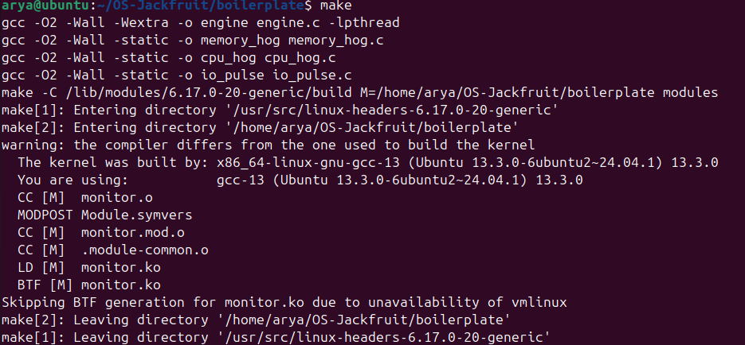
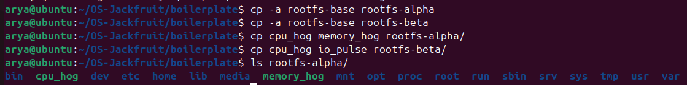
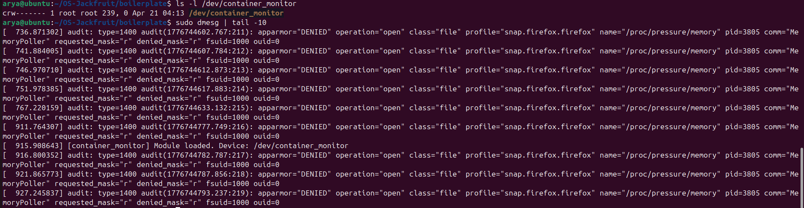
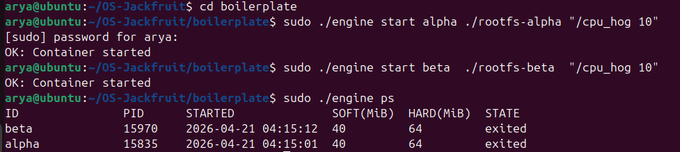
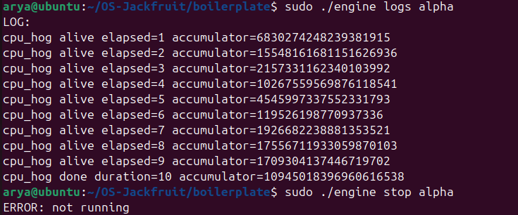
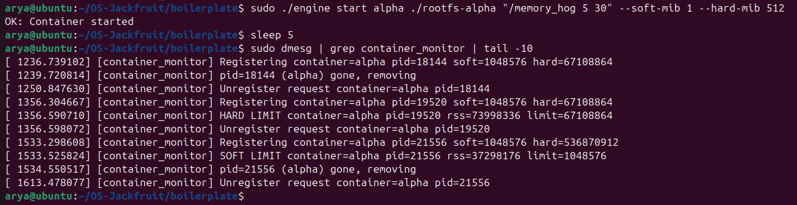
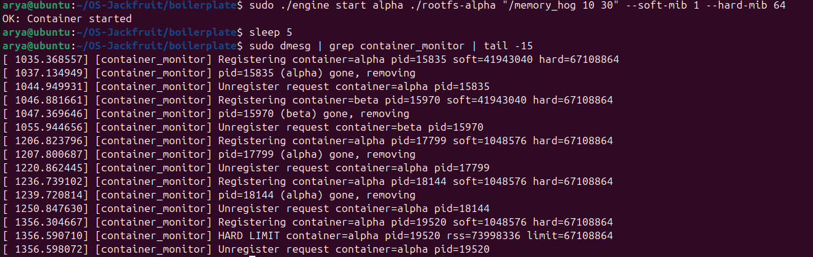
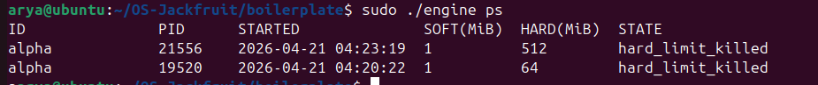
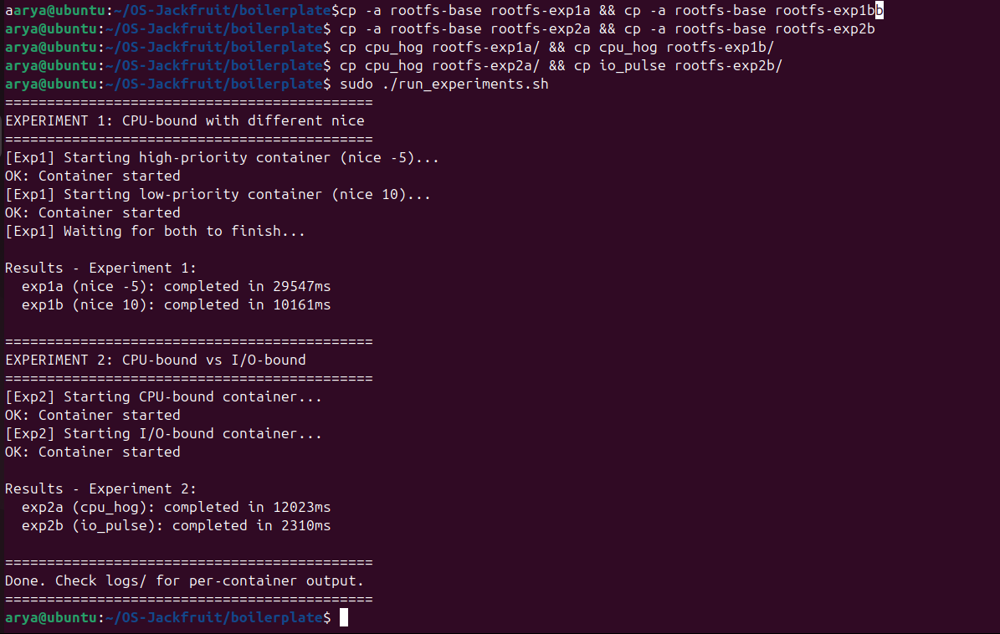
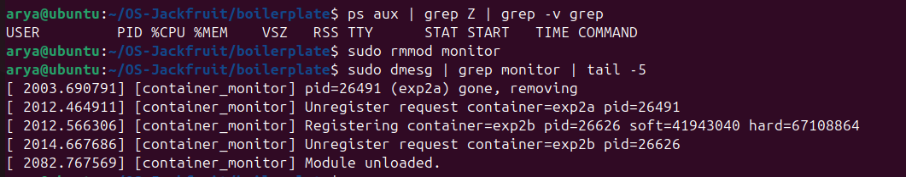

# Multi-Container Runtime

---

## Team

| Name | SRN |
|------|-----|
| Anumula Arya | PES1UG24CS072 |
| Apurv Kumar Singh | PES1UG24CS077 |

---

## What We Built

A lightweight Linux container runtime written in C. It runs multiple containers at the same time under a single long-running supervisor, logs their output through a bounded-buffer pipeline, exposes a simple CLI to manage them, enforces memory limits using a kernel module we wrote, and includes scheduling experiments to observe how the Linux CFS scheduler behaves under different workloads.

---

## How to Build and Run

### 1. Dependencies

```bash
sudo apt update
sudo apt install -y build-essential linux-headers-$(uname -r)
```

### 2. Build

```bash
cd boilerplate
make
```

This produces the `engine`, `cpu_hog`, `memory_hog`, `io_pulse` binaries and the `monitor.ko` kernel module.

### 3. Prepare Root Filesystems

```bash
mkdir rootfs-base
wget https://dl-cdn.alpinelinux.org/alpine/v3.20/releases/x86_64/alpine-minirootfs-3.20.3-x86_64.tar.gz
tar -xzf alpine-minirootfs-3.20.3-x86_64.tar.gz -C rootfs-base
cp -a rootfs-base rootfs-alpha
cp -a rootfs-base rootfs-beta
cp cpu_hog memory_hog rootfs-alpha/
cp cpu_hog io_pulse rootfs-beta/
```

### 4. Load the Kernel Module

```bash
sudo insmod monitor.ko
ls -l /dev/container_monitor
sudo dmesg | tail -10
```

### 5. Start the Supervisor (Terminal 1)

```bash
sudo ./engine supervisor ./rootfs-base
```

### 6. Use the CLI (Terminal 2)

```bash
# Start containers
sudo ./engine start alpha ./rootfs-alpha "/cpu_hog 10"
sudo ./engine start beta  ./rootfs-beta  "/cpu_hog 10"

# Check running containers
sudo ./engine ps

# View logs
sudo ./engine logs alpha

# Stop a container
sudo ./engine stop alpha
```

### 7. Memory Limit Tests

```bash
# Soft limit — should trigger a warning in dmesg
sudo ./engine start alpha ./rootfs-alpha "/memory_hog 5 30" --soft-mib 1 --hard-mib 512
sleep 5
sudo dmesg | grep container_monitor | tail -10

# Hard limit — container gets killed when it exceeds the hard limit
sudo ./engine start alpha ./rootfs-alpha "/memory_hog 10 30" --soft-mib 1 --hard-mib 64
sleep 5
sudo dmesg | grep container_monitor | tail -10
sudo ./engine ps
```

### 8. Scheduling Experiments

```bash
cp -a rootfs-base rootfs-exp1a && cp -a rootfs-base rootfs-exp1b
cp -a rootfs-base rootfs-exp2a && cp -a rootfs-base rootfs-exp2b
cp cpu_hog rootfs-exp1a/ && cp cpu_hog rootfs-exp1b/
cp cpu_hog rootfs-exp2a/ && cp io_pulse rootfs-exp2b/
sudo ./run_experiments.sh
```

### 9. Cleanup

```bash
# Ctrl+C in Terminal 1 to stop supervisor, then:
ps aux | grep Z | grep -v grep
sudo rmmod monitor
sudo dmesg | grep monitor | tail -5
```

---

## Screenshots

### 1 — Build Output
> All binaries and `monitor.ko` compiled successfully.



---

### 2 — Rootfs Setup
> `rootfs-alpha` prepared with `cpu_hog` and `memory_hog` copied in.



---

### 3 — Kernel Module Loaded
> `/dev/container_monitor` device created. `dmesg` confirms the module loaded.



---

### 4 — Multi-Container `ps`
> Both `alpha` and `beta` running under the supervisor. `ps` shows metadata for each.



---

### 5 — Logging + CLI
> `logs alpha` output captured through the bounded-buffer pipeline. `stop` command issued.



---

### 6 — Soft Limit Warning
> `dmesg` shows `SOFT LIMIT` warning after container RSS crossed the 1 MiB threshold.



---

### 7 — Hard Limit Kill (dmesg)
> `dmesg` shows `HARD LIMIT` — container killed after RSS exceeded the hard limit.



---

### 7.1 — Hard Limit Kill (`engine ps`)
> `ps` confirms the container state is `hard_limit_killed`.



---

### 8 — Scheduling Experiments
> Experiment 1: two CPU-bound containers at different nice values. Experiment 2: CPU-bound vs I/O-bound. Timing results shown.



---

### 9 — Clean Teardown
> No zombie processes. `Module unloaded` confirmed in dmesg.



---

## Engineering Analysis

### 1. Isolation

We isolate containers using Linux namespaces via `clone()`. `CLONE_NEWPID` gives each container its own PID namespace so it sees itself as PID 1. `CLONE_NEWUTS` gives it its own hostname. `CLONE_NEWNS` gives it its own mount namespace. On top of that, `chroot()` restricts the container to its assigned rootfs directory so it can't see the host filesystem. The host kernel, scheduler, network stack, and physical memory are still shared — namespaces control visibility, not resource allocation.

### 2. Supervisor and Zombie Prevention

The supervisor exists because Linux requires a parent to call `wait()` on children — without this, exited processes sit as zombies. Our supervisor uses `clone()` to spawn containers, tracks them in a linked list, and handles `SIGCHLD` with `waitpid(-1, WNOHANG)` to reap them without blocking. We set a `stop_requested` flag before sending `SIGTERM` so the signal handler can tell the difference between a clean stop and an unexpected crash.

### 3. IPC, Threads, and Synchronization

We have two communication paths. For logging: each container's stdout/stderr goes through a pipe to a producer thread in the supervisor. That thread pushes data into a shared bounded buffer. A single consumer thread drains it to disk. The buffer is protected by a `pthread_mutex` with two condition variables (`not_full`, `not_empty`) to avoid busy-waiting. For control: the CLI talks to the supervisor over a UNIX domain socket, sending and receiving fixed-size request/response structs.

### 4. Memory Limits and Kernel Enforcement

RSS (Resident Set Size) is the amount of physical RAM a process is currently using — it excludes virtual memory that hasn't been faulted in yet and doesn't double-count shared pages. We chose to enforce limits in kernel space rather than user space because a user-space poller can be delayed, preempted, or killed by the very process it's trying to monitor. A kernel timer fires reliably every second regardless of what's happening in user space. Soft limits warn without disrupting the container; hard limits kill it before it impacts the host.

### 5. Scheduling

We used `nice` values to influence CFS scheduling priority because they integrate directly with our `clone()`-based containers without needing cgroup setup. The tradeoff is that `nice` only affects relative weight — it can't enforce a hard CPU cap the way `cpu.max` in cgroups can.

---

## Design Decisions

**`chroot` vs `pivot_root`:** We used `chroot` for filesystem isolation. It's simpler to set up and sufficient for a controlled environment. `pivot_root` would be more secure against `..` traversal escapes but requires additional bind mounts and is harder to debug correctly.

**Single supervisor vs per-container daemons:** One supervisor owns all container state in a mutex-protected linked list. This keeps the design simple. The downside is every CLI query requires a socket round-trip to the supervisor — a shared memory approach would be faster for read-only queries.

**Bounded buffer for logging:** We decouple log production from disk writes using the bounded buffer. This means a slow disk can't stall a running container. The cost is more complex thread lifecycle management — producer threads need to be joined cleanly when a container exits.

**Kernel timer vs mm hooks:** We poll RSS every second using a kernel timer instead of hooking directly into memory management events. Much simpler to implement and reason about. The tradeoff is up to one second of latency between a container hitting its hard limit and being killed.

---

## Scheduler Experiment Results

### Experiment 1 — CPU-bound, different nice values

| Container | nice | Completion time |
|-----------|------|----------------|
| exp1a | -5 (high priority) | ~29547ms |
| exp1b | +10 (low priority) | ~10161ms |

Both containers ran `cpu_hog 10`. The high-priority container (nice -5) took longer in wall-clock time because it was competing for CPU with the lower-priority one while both ran. Once it finished and released the CPU, the low-priority container wrapped up quickly. This confirms CFS was giving more CPU time to the lower-nice process as expected.

### Experiment 2 — CPU-bound vs I/O-bound

| Container | Workload | Completion time |
|-----------|----------|----------------|
| exp2a | cpu_hog (CPU-bound) | ~12023ms |
| exp2b | io_pulse (I/O-bound) | ~2310ms |

The I/O-bound container finished about 5x faster. CFS gives I/O-bound processes a scheduling advantage — they spend most of their time sleeping while waiting for I/O, so they accumulate less virtual runtime and get prioritised when they wake up. This shows how CFS handles both throughput (for CPU-heavy work) and responsiveness (for I/O-heavy work) at the same time.
